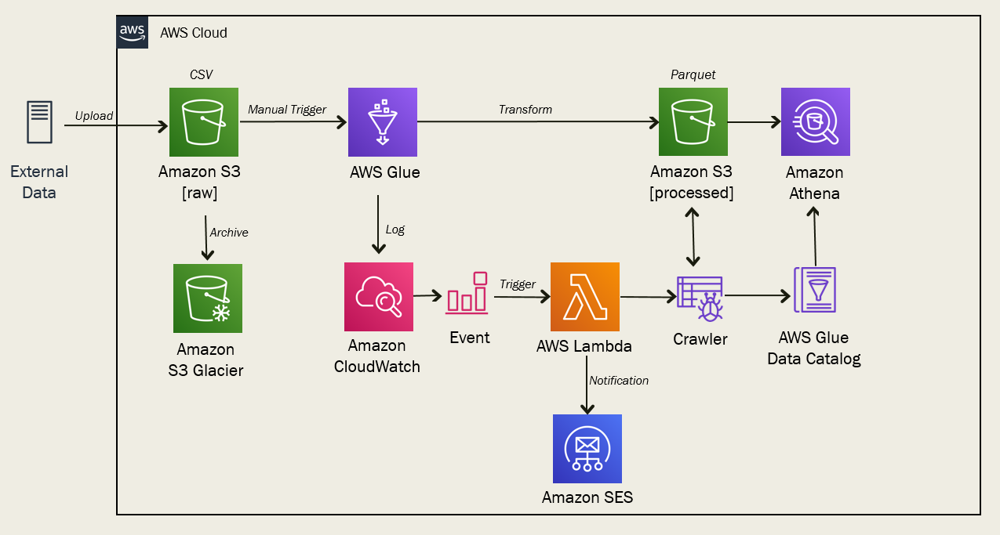
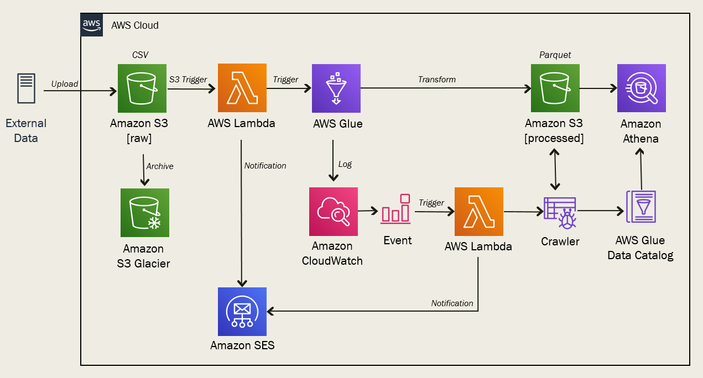

# AWS Batch Pipeline - Serverless ETL

This project demonstrates a **Serverless ETL Pipeline** using various AWS services. It showcases how data can be processed automatically using event-driven architecture, batch jobs, and querying with Athena.

---

## 🧠 Key Concepts

- **Event-Driven Data Ingestion**
- **Serverless Architecture (Lambda, Glue, S3)**
- **ETL with AWS Glue**
- **Data Cataloging with Glue Crawlers**
- **SQL Querying with AWS Athena**
- **Monitoring with CloudWatch**
- **Orchestration via Lambda Functions**

---

## 📁 Project Structure

```
aws_batch_pipeline/
├── architecture_history.png
├── architecture_incremental.png
├── glue-etl.py
├── lambda-trigger-glue-crawler.py
├── lambda-trigger-glue-job.py
├── README.md
```

---

## 🏗️ Architecture

### 🔁 History-Based ETL

This architecture loads **entire datasets** periodically and transforms them using AWS Glue.



### 🔄 Incremental ETL

This approach loads **only new or modified data**, making it more efficient and scalable.



---

## 🔧 AWS Services Used

| Service     | Purpose                                                      |
|-------------|--------------------------------------------------------------|
| **S3**      | Stores raw and processed data                                |
| **Lambda**  | Event-based trigger for Glue jobs and crawlers               |
| **Glue**    | Runs ETL jobs and crawls data catalog                        |
| **Athena**  | Queries transformed data using SQL                           |
| **CloudWatch** | Logs Lambda executions and Glue job monitoring            |

---

## 🚀 Workflow Steps

1. **Data Upload**  
   Raw data is uploaded to an S3 bucket.

2. **Trigger Lambda Function**  
   Automatically triggers Lambda when new data arrives.

3. **Glue Crawler Execution**  
   Lambda starts the Glue crawler to scan the new data and update the Data Catalog.

4. **ETL Job Execution**  
   Another Lambda triggers the Glue job to process and transform data.

5. **Athena Query**  
   Transformed data stored back in S3 can be queried using Athena.

---

## 🧪 How to Run (Locally or Simulated)

1. Place raw data files into the defined S3 bucket.
2. Simulate an S3 event to trigger Lambda.
3. Ensure your IAM roles allow Glue and Lambda interactions.
4. Check Glue catalog tables after crawling.
5. Run Athena queries on transformed datasets.

---

## 🛠️ Setup Instructions

1. **Clone the Repo**
   ```bash
   git clone https://github.com/swaroop201/AWS_Batch_Pipeline.git
   cd AWS_Batch_Pipeline
   ```

2. **Update AWS Credentials**
   Make sure your AWS CLI or environment has access to:
   - Lambda
   - Glue
   - S3
   - Athena

3. **Deploy Lambda Functions**
   Use the AWS Console or `zip` and upload:
   ```bash
   zip function.zip lambda-trigger-glue-job.py
   ```

4. **Deploy Glue ETL Script**
   - Create a new Glue job using the script `glue-etl.py`.

---

## 📊 Example Athena Query

```sql
SELECT customer_id, total_amount
FROM transactions_transformed
WHERE purchase_date >= DATE '2024-01-01';
```

---

## 📌 Notes

- This project is for learning and demo purposes.
- You can expand it by:
  - Adding SNS for alerting
  - Integrating with Step Functions
  - Creating partitioned datasets in Glue

---

## 📸 Credits

Architecture images are referenced from public educational material and adapted for this project.

---

## 🧑‍💻 Author

**Swaroop**  
[LinkedIn](https://www.linkedin.com/in/swaroop-jrj/) | [GitHub](https://github.com/swaroop201)

---

## 📄 License

MIT License
